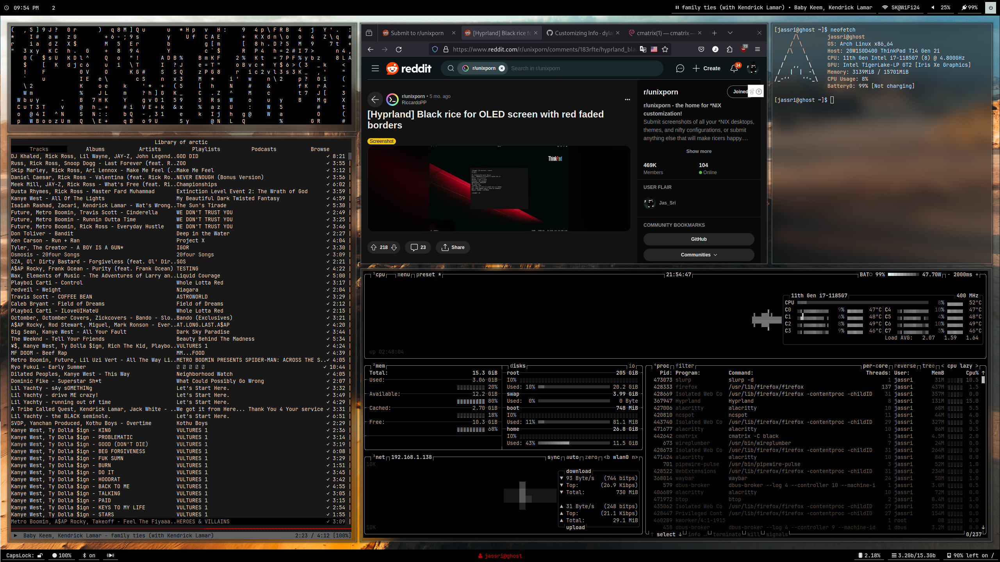

# Jas Sri's Hyprland Dots

These are my dotfiles that I use on my workhorse, unfortunately I'm not skilled enough with scripting to create a script that can install it for you so for now just copy into your .config folder.

This collection of styling is meant to work with a laptop as it features scripts for brightness but can easily be removed to fit for a desktop through the modification/deletion of certain files and lines. This repository of dots takes heavy inspiration from [Darshan's](https://github.com/darshanCommits/Linux-Scripts-Dots) dots which were featured in this [reddit post](https://www.reddit.com/r/unixporn/comments/19f40cb/hyprland_i_see_a_door_and_i_want_to_paint_it_black/) on r/unixporn. This repo also makes use of [adi1090x's](https://github.com/adi1090x/rofi/) collection of clean and easy to use Rofi configs.

## Usage

Simply drag and drop my dotfiles into your ```.config/``` folder in your home, or copy these set of commands:

```
git clone https://github.com/jsrii/dots.git
mv ~/dots ~/.config
```

Then reload your apps or just restart your device and the configs should be applied.

## Screenshots




